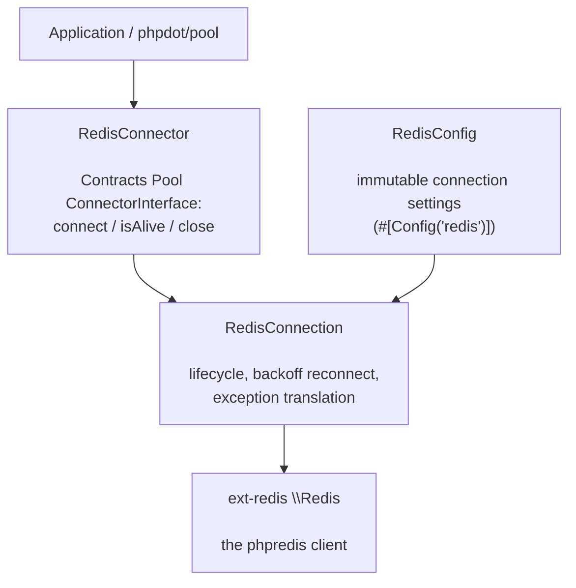

# phpdot/redis

A coroutine-safe Redis client wrapping [ext-redis](https://github.com/phpredis/phpredis) (phpredis). It
adds automatic reconnection with exponential backoff, translates driver errors into typed exceptions,
and ships a connector so [phpdot/pool](https://github.com/phpdot/pool) can hold and recycle connections.
One `\Redis` client lives per connection, so a pool gives each Swoole coroutine its own.

## Table of Contents

- [Requirements](#requirements)
- [Installation](#installation)
- [Usage](#usage)
- [Architecture](#architecture)
- [Testing](#testing)
- [License](#license)

## Requirements

| Requirement | Constraint |
|---|---|
| PHP | `>= 8.5` |
| `ext-redis` | `^6.0` |
| `phpdot/contracts` | `^0.1` |

`phpdot/container` is a dev-only suggestion — the `#[Config('redis')]` attribute on `RedisConfig` is
inert until a phpdot application reflects it.

## Installation

```bash
composer require phpdot/redis
```

## Usage

### Connecting

```php
use PHPdot\Redis\Config\RedisConfig;
use PHPdot\Redis\RedisConnection;

$connection = new RedisConnection(new RedisConfig(
    host: '127.0.0.1',
    port: 6379,
    password: 'secret',
    database: 0,
));

$connection->connect();

// Reach the underlying ext-redis \Redis client for commands
$connection->getClient()->set('hello', 'world');
$connection->getClient()->get('hello'); // 'world'

$connection->close();
```

`RedisConfig` is an immutable value object carrying every ext-redis connection option — host/port or a
Unix socket `path`, `username`/`password` (ACL or legacy AUTH), `database`, TLS with stream SSL options,
timeouts, and `maxRetries` for the backoff.

### Resilience

`connect()` retries with exponential backoff (100ms, 200ms, 400ms, …) up to `maxRetries` before throwing
a `ConnectionException`. Authentication failures throw an `AuthenticationException` immediately — retrying
bad credentials never helps. Both extend the package's `RedisException` base.

### Pooling

`RedisConnector` adapts a `RedisConnection` to `phpdot/pool`'s `ConnectorInterface`, so a pool can build,
health-check, and recycle connections:

```php
use PHPdot\Redis\RedisConnector;

$connector = new RedisConnector(new RedisConfig(host: '127.0.0.1'));
// hand $connector to a phpdot/pool Pool — connect() opens, isAlive() pings, close() tears down
```

## Architecture

`RedisConnection` owns one ext-redis `\Redis` client and drives its lifecycle — connecting with backoff,
pinging for liveness, and translating `RedisException`s into the package's typed hierarchy.
`RedisConnector` is the thin bridge to `phpdot/pool`, so the connection type stays pool-agnostic.



## Testing

```bash
composer install
composer test        # PHPUnit
composer analyse     # PHPStan, level max + strict rules
composer cs-check    # PHP-CS-Fixer
composer check       # All three
```

The unit suite covers the disconnected-state contract with no server. The integration suite connects to
a live Redis at `127.0.0.1:6379` and **skips automatically when none is reachable**.

## License

MIT.

**This repository is a read-only mirror**, generated by CI from
[phpdot/monorepo](https://github.com/phpdot/monorepo). [Pull requests](https://github.com/phpdot/monorepo/pulls)
and [issues](https://github.com/phpdot/monorepo/issues) belong in the monorepo.
